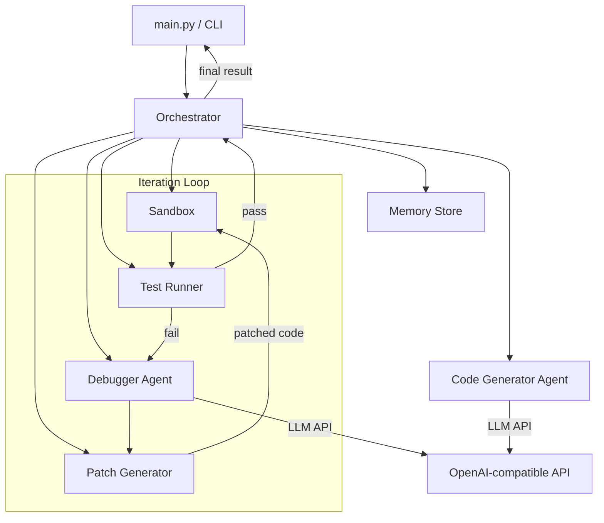
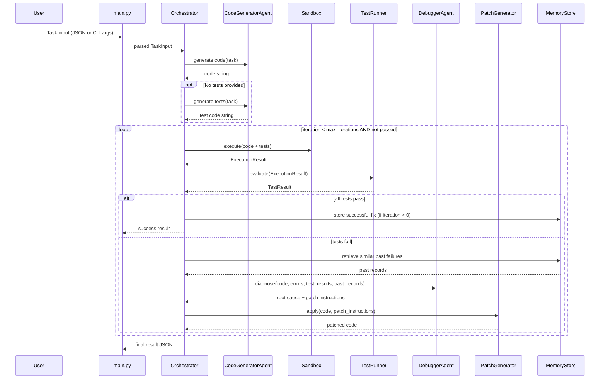
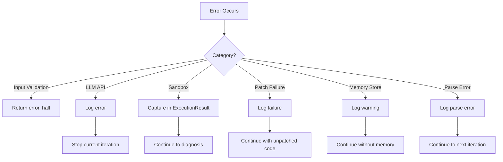

# Design Document: Autonomous Self-Debugging AI Code Agent

## Overview

This system implements an autonomous self-debugging code agent that accepts programming tasks, generates Python solutions via an OpenAI-compatible LLM, executes them in a sandboxed environment, and iteratively debugs failures through an LLM-powered diagnosis-and-patch loop. The architecture follows a pipeline pattern: **generate → execute → test → diagnose → patch → repeat**, controlled by a deterministic orchestrator loop.

The system is designed as a CLI tool with a modular structure that cleanly separates concerns: LLM interaction (agents), code execution (sandbox), test evaluation (tests), and failure memory (memory). This separation enables future extension into a multi-agent system.

### Key Design Decisions

1. **Subprocess-first sandbox with Docker optional**: The default execution backend uses `subprocess.run()` with restricted permissions. Docker execution is available as a configurable backend via the `docker` Python SDK. This keeps the MVP simple while supporting stronger isolation.

2. **String-based patching over file-based diffs**: Since all code lives in memory as strings (single-module solutions), patches are applied using Python's `difflib` for generating unified diffs and a custom applicator for applying them. No filesystem-based patch tools are needed.

3. **OpenAI Python SDK (v1+)**: Uses the `openai` package with the client-based API (`client.chat.completions.create()`), which supports any OpenAI-compatible endpoint via `base_url` configuration.

4. **Hypothesis for property-based testing**: The project uses the [Hypothesis](https://hypothesis.readthedocs.io/) library for property-based tests of its own internal logic (parsing, patching, serialization).

5. **JSON-file memory store**: Past failures and fixes are stored in a simple JSON file on disk. This avoids external dependencies while providing cross-session persistence.

## Architecture



### Control Flow




## Components and Interfaces

### 1. CLI Entry Point (`main.py`)

Parses command-line arguments and constructs a `TaskInput` object. Uses Python's `argparse` module.

```python
# Interface
def main() -> None:
    """Parse CLI args, build TaskInput, invoke Orchestrator, print result."""

# CLI Arguments:
#   (no args)           → run demo tasks
#   --task DESCRIPTION  → use provided task
#   --tests FILE_PATH   → read test code from file
#   --max-iterations N  → override default max iterations
```

### 2. Orchestrator (`orchestrator.py`)

The central controller that manages the generate → execute → test → debug → patch loop. Deterministic loop control with no recursion.

```python
class Orchestrator:
    def __init__(self, config: OrchestratorConfig) -> None: ...

    def run(self, task_input: TaskInput) -> FinalResult:
        """
        Execute the full pipeline:
        1. Generate code (and tests if not provided)
        2. Loop: execute → test → diagnose → patch
        3. Return structured FinalResult
        """

    def _execute_iteration(self, code: str, tests: str, iteration: int) -> IterationLog:
        """Run a single iteration of the debug loop."""
```

### 3. Code Generator Agent (`agents/code_generator.py`)

Interacts with the LLM to produce initial code and optional test generation.

```python
class CodeGeneratorAgent:
    def __init__(self, llm_client: LLMClient) -> None: ...

    def generate_code(self, task_description: str) -> GenerationResult:
        """Send task to LLM, parse response, return code string."""

    def generate_tests(self, task_description: str, code: str) -> GenerationResult:
        """Generate pytest/unittest tests for the given task and code."""
```

### 4. Debugger Agent (`agents/debugger.py`)

Analyzes failures and produces patch instructions.

```python
class DebuggerAgent:
    def __init__(self, llm_client: LLMClient) -> None: ...

    def diagnose(
        self,
        code: str,
        error_logs: str,
        test_results: TestResult,
        past_fixes: list[MemoryRecord],
    ) -> DiagnosisResult:
        """
        Send failure context to LLM.
        Return root cause analysis + unified diff patch.
        """
```

### 5. LLM Client (`agents/llm_client.py`)

Thin wrapper around the OpenAI Python SDK. Supports any OpenAI-compatible endpoint.

```python
class LLMClient:
    def __init__(self, api_key: str, base_url: str | None = None, model: str = "gpt-4") -> None: ...

    def chat(self, messages: list[dict], temperature: float = 0.2) -> str:
        """Send chat completion request, return assistant message content."""
```

### 6. Response Parser (`agents/response_parser.py`)

Extracts structured data from LLM text responses.

```python
def extract_code_block(response: str) -> str:
    """Extract Python code from markdown code fences in LLM response."""

def format_code_block(code: str) -> str:
    """Wrap code string in markdown code fences."""

def extract_patch(response: str) -> PatchData:
    """Extract root cause analysis and unified diff from LLM response."""
```

### 7. Sandbox (`sandbox/executor.py`)

Executes code in an isolated environment. Two backends: subprocess (default) and Docker.

```python
class SandboxExecutor(Protocol):
    def execute(self, code: str, timeout: int = 30) -> ExecutionResult: ...

class SubprocessSandbox:
    def execute(self, code: str, timeout: int = 30) -> ExecutionResult:
        """Run code via subprocess.run() with restricted permissions."""

class DockerSandbox:
    def __init__(self, image: str = "python:3.12-slim") -> None: ...
    def execute(self, code: str, timeout: int = 30) -> ExecutionResult:
        """Run code in a Docker container via docker SDK."""
```

### 8. Test Runner (`tests/runner.py`)

Executes tests within the sandbox and parses results into structured output.

```python
class TestRunner:
    def __init__(self, sandbox: SandboxExecutor) -> None: ...

    def run(self, code: str, test_code: str) -> TestResult:
        """
        Combine code + tests into a single script,
        execute in sandbox, parse output into TestResult.
        """
```

### 9. Patch Generator (`sandbox/patcher.py`)

Applies unified diffs to code strings.

```python
class PatchGenerator:
    def apply_patch(self, original_code: str, unified_diff: str) -> PatchResult:
        """
        Parse unified diff and apply to original code string.
        Return PatchResult with updated code or error.
        """

    def generate_diff(self, original: str, modified: str) -> str:
        """Generate unified diff between two code strings using difflib."""
```

### 10. Memory Store (`memory/store.py`)

Persists past failure-fix records to a JSON file.

```python
class MemoryStore:
    def __init__(self, filepath: str = "memory/memory.json") -> None: ...

    def store(self, record: MemoryRecord) -> None:
        """Append a failure-fix record to the JSON file."""

    def retrieve_similar(self, error_signature: str, top_k: int = 3) -> list[MemoryRecord]:
        """Find past records with similar error signatures using substring matching."""

    def _load(self) -> list[dict]: ...
    def _save(self, records: list[dict]) -> None: ...
```


## Data Models

All data models are defined as Python `dataclasses` in a shared `models.py` module.

```python
from dataclasses import dataclass, field
from typing import Optional
from datetime import datetime


@dataclass
class TaskInput:
    task: str
    tests: Optional[str] = None


@dataclass
class OrchestratorConfig:
    max_iterations: int = 5
    timeout: int = 30
    sandbox_type: str = "subprocess"  # "subprocess" or "docker"
    llm_model: str = "gpt-4"
    llm_api_key: str = ""
    llm_base_url: Optional[str] = None


@dataclass
class GenerationResult:
    code: str
    raw_response: str
    metadata: dict = field(default_factory=dict)


@dataclass
class ExecutionResult:
    stdout: str
    stderr: str
    exit_code: int
    exception_trace: Optional[str] = None
    timed_out: bool = False


@dataclass
class TestResult:
    status: str  # "pass" or "fail"
    tests_passed: int = 0
    tests_failed: int = 0
    failure_details: list[dict] = field(default_factory=list)
    raw_output: str = ""


@dataclass
class PatchData:
    root_cause: str
    unified_diff: str


@dataclass
class DiagnosisResult:
    root_cause: str
    patch_data: PatchData
    raw_response: str


@dataclass
class PatchResult:
    success: bool
    patched_code: Optional[str] = None
    error_message: Optional[str] = None


@dataclass
class IterationLog:
    iteration: int
    timestamp: str
    code_snapshot: str
    execution_result: ExecutionResult
    test_result: TestResult
    diagnosis: Optional[DiagnosisResult] = None
    patch_result: Optional[PatchResult] = None


@dataclass
class FinalResult:
    final_code: str
    iterations_used: int
    status: str  # "success" or "failed"
    logs: list[IterationLog] = field(default_factory=list)


@dataclass
class MemoryRecord:
    error_signature: str
    root_cause: str
    patch_diff: str
    task_description: str
    timestamp: str = field(default_factory=lambda: datetime.now().isoformat())
```

### Serialization

All dataclasses support JSON serialization via `dataclasses.asdict()`. The `FinalResult` is serialized to JSON for the CLI output. The `MemoryStore` serializes `MemoryRecord` objects to/from JSON for disk persistence.

```python
import json
from dataclasses import asdict

def serialize(obj) -> str:
    return json.dumps(asdict(obj), indent=2)

def deserialize_memory_record(data: dict) -> MemoryRecord:
    return MemoryRecord(**data)
```

### File Layout

```
project/
├── main.py                    # CLI entry point
├── orchestrator.py            # Central loop controller
├── models.py                  # All dataclass definitions
├── agents/
│   ├── __init__.py
│   ├── llm_client.py          # OpenAI SDK wrapper
│   ├── code_generator.py      # Code generation agent
│   ├── debugger.py            # Failure diagnosis agent
│   └── response_parser.py     # LLM response parsing
├── sandbox/
│   ├── __init__.py
│   ├── executor.py            # Sandbox backends (subprocess, Docker)
│   └── patcher.py             # Unified diff patch application
├── tests/
│   ├── __init__.py
│   └── runner.py              # Test execution and result parsing
├── memory/
│   ├── __init__.py
│   ├── store.py               # JSON-based memory persistence
│   └── memory.json            # Persisted failure-fix records
├── demo_tasks/
│   ├── task1.json             # Demo task: simple function
│   └── task2.json             # Demo task: data structure
└── requirements.txt           # Python dependencies
```

### Dependencies

```
openai>=1.0.0
docker>=7.0.0
hypothesis>=6.100.0
pytest>=8.0.0
```


## Correctness Properties

*A property is a characteristic or behavior that should hold true across all valid executions of a system — essentially, a formal statement about what the system should do. Properties serve as the bridge between human-readable specifications and machine-verifiable correctness guarantees.*

### Property 1: TaskInput parsing correctness

*For any* string input, parsing it as a TaskInput SHALL either produce a valid TaskInput object (when the input is valid JSON containing a "task" field) or return a descriptive error (when the input is malformed JSON or missing the "task" field). In the success case, the parsed TaskInput's `task` field must equal the original JSON's "task" value, and the `tests` field must equal the "tests" value if present.

**Validates: Requirements 1.1, 1.3, 1.4**

### Property 2: Sandbox output capture

*For any* Python code string that produces stdout output, stderr output, or raises an exception, the Sandbox SHALL return an ExecutionResult where `stdout` contains the printed output, `stderr` contains error output, and `exception_trace` contains the traceback string. The `exit_code` SHALL be 0 for successful execution and non-zero for failures.

**Validates: Requirements 4.2, 4.3**

### Property 3: Test result parsing

*For any* test execution output containing N total tests with P passes and F failures (where P + F = N), the TestRunner SHALL produce a TestResult where `tests_passed` equals P, `tests_failed` equals F, `status` is "pass" when F == 0 and "fail" when F > 0, and `failure_details` contains exactly F entries.

**Validates: Requirements 5.2, 5.3, 5.4**

### Property 4: Patch application round-trip

*For any* two Python code strings A and B, generating a unified diff from A to B and then applying that diff to A SHALL produce B. All lines in A that are not mentioned in the diff SHALL appear unchanged in the result.

**Validates: Requirements 7.1, 7.2, 7.4**

### Property 5: Invalid patch detection

*For any* code string and any unified diff that does not match the code's content (mismatched line numbers or context), applying the patch SHALL return a PatchResult with `success` set to False and a non-empty `error_message`.

**Validates: Requirements 7.3**

### Property 6: Orchestrator loop termination

*For any* max_iterations value N (where N >= 1) and any sequence of test results, the Orchestrator loop SHALL execute at most N iterations. If tests pass at iteration K (where K <= N), the loop SHALL stop at iteration K and return status "success". If no tests pass within N iterations, the loop SHALL stop at exactly N iterations and return status "failed".

**Validates: Requirements 8.1, 8.2, 8.3, 8.5**

### Property 7: FinalResult serialization round-trip

*For any* valid FinalResult object (containing any combination of iteration logs with timestamps), serializing it to JSON and deserializing the JSON back SHALL produce an equivalent FinalResult. The `logs` array SHALL maintain chronological order after the round-trip.

**Validates: Requirements 10.1, 10.3, 9.1**

### Property 8: MemoryRecord persistence round-trip

*For any* valid MemoryRecord object, storing it to the MemoryStore and then loading all records from disk SHALL include a record equivalent to the original. The stored JSON file SHALL be valid JSON after each write.

**Validates: Requirements 11.1, 11.3**

### Property 9: Memory retrieval by error signature

*For any* set of stored MemoryRecords and any query string, retrieving similar records SHALL return only records whose `error_signature` contains the query as a substring. The returned list SHALL not contain records whose `error_signature` does not contain the query.

**Validates: Requirements 11.2**

### Property 10: Code block parse/format round-trip

*For any* valid Python code string, formatting it into a markdown code block and then parsing the code block SHALL produce the original code string. Repeating this cycle (format → parse → format → parse) SHALL produce the same result as a single cycle.

**Validates: Requirements 14.1, 14.3**

### Property 11: Patch instruction extraction round-trip

*For any* root cause analysis text and unified diff string, formatting them into an LLM response and then extracting the root cause and diff SHALL produce the original root cause text and unified diff.

**Validates: Requirements 14.2**

### Property 12: Unrecognizable response rejection

*For any* string that does not contain markdown code fences (``` markers), attempting to extract a code block SHALL return a descriptive parse error. The error message SHALL be non-empty.

**Validates: Requirements 14.4**


## Error Handling

### Error Categories

| Category | Source | Handling Strategy |
|---|---|---|
| **Input Validation** | CLI args, TaskInput JSON | Return descriptive error, halt before pipeline starts |
| **LLM API Errors** | OpenAI SDK exceptions | Catch `openai.APIError` and subclasses, propagate descriptive message to Orchestrator, log error, stop iteration |
| **Sandbox Errors** | Timeout, crash, permission denied | Capture in ExecutionResult (timed_out flag, stderr), continue to diagnosis |
| **Patch Failures** | Diff doesn't apply cleanly | Return PatchResult with success=False, Orchestrator logs and continues to next iteration with unpatched code |
| **Memory Store Errors** | File I/O, corrupt JSON | Log warning, continue without memory context (graceful degradation) |
| **Parse Errors** | LLM response missing code fences | Return descriptive error, Orchestrator logs and continues to next iteration |

### Error Propagation Flow



### Design Decisions

1. **Fail-forward in the loop**: Sandbox errors and patch failures do not terminate the loop. The Orchestrator logs the error and continues, giving the LLM another chance to produce a working fix. Only input validation errors and unrecoverable LLM API errors halt execution.

2. **Memory store is non-critical**: If the memory file is corrupt or inaccessible, the system continues without historical context. This prevents a secondary system from blocking the primary debug loop.

3. **Structured error messages**: All error messages include the error category, a human-readable description, and the original exception message when available. This supports both CLI output and programmatic consumption.

## Testing Strategy

### Dual Testing Approach

The system uses both unit tests and property-based tests for comprehensive coverage.

#### Property-Based Tests (Hypothesis)

Property-based tests use the [Hypothesis](https://hypothesis.readthedocs.io/) library with a minimum of 100 iterations per property. Each test references its design document property.

| Property | Module Under Test | Key Generators |
|---|---|---|
| P1: TaskInput parsing | `orchestrator.py` | `st.text()`, `st.fixed_dictionaries()` |
| P2: Sandbox output capture | `sandbox/executor.py` | `st.text()` for print statements |
| P3: Test result parsing | `tests/runner.py` | `st.integers()` for pass/fail counts |
| P4: Patch round-trip | `sandbox/patcher.py` | `st.text()` for code line pairs |
| P5: Invalid patch detection | `sandbox/patcher.py` | `st.text()` for mismatched diffs |
| P6: Loop termination | `orchestrator.py` | `st.integers(1,20)`, `st.lists(st.booleans())` |
| P7: FinalResult round-trip | `models.py` | Composite strategy for FinalResult |
| P8: MemoryRecord round-trip | `memory/store.py` | Composite strategy for MemoryRecord |
| P9: Memory retrieval | `memory/store.py` | `st.text()`, `st.lists()` |
| P10: Code block round-trip | `agents/response_parser.py` | `st.text()` for code strings |
| P11: Patch extraction round-trip | `agents/response_parser.py` | `st.text()` for root cause + diff |
| P12: Unrecognizable response | `agents/response_parser.py` | `st.text().filter(no_fences)` |

Tag format for each test:
```python
# Feature: self-debugging-ai-agent, Property 4: Patch application round-trip
@given(original=st.text(), modified=st.text())
@settings(max_examples=100)
def test_patch_round_trip(original, modified):
    ...
```

#### Unit Tests (pytest)

Unit tests cover specific examples, integration points, and edge cases:

- **CLI parsing**: Verify `--task`, `--tests`, `--max-iterations` arguments
- **LLM client**: Mock OpenAI SDK, test error handling for API failures
- **Code generator**: Mock LLM responses, verify prompt construction
- **Debugger agent**: Mock LLM responses, verify failure context is sent
- **Sandbox timeout**: Verify infinite loop is terminated
- **Demo tasks**: Verify demo task files exist and are valid JSON
- **Orchestrator integration**: End-to-end with mocked LLM, verify full pipeline

#### Integration Tests

- **Subprocess sandbox**: Execute real Python code, verify output capture
- **Docker sandbox** (optional): Execute in container, verify isolation
- **Memory persistence**: Write/read across MemoryStore instances

### Test Organization

```
project/
├── tests/
│   ├── __init__.py
│   ├── runner.py              # TestRunner (production code)
│   ├── test_models.py         # Property tests for data models (P1, P7)
│   ├── test_parser.py         # Property tests for response parsing (P10, P11, P12)
│   ├── test_patcher.py        # Property tests for patching (P4, P5)
│   ├── test_runner.py         # Property tests for test result parsing (P3)
│   ├── test_sandbox.py        # Property + integration tests for sandbox (P2)
│   ├── test_memory.py         # Property tests for memory store (P8, P9)
│   ├── test_orchestrator.py   # Property + unit tests for loop control (P6)
│   └── test_cli.py            # Unit tests for CLI argument parsing
```
